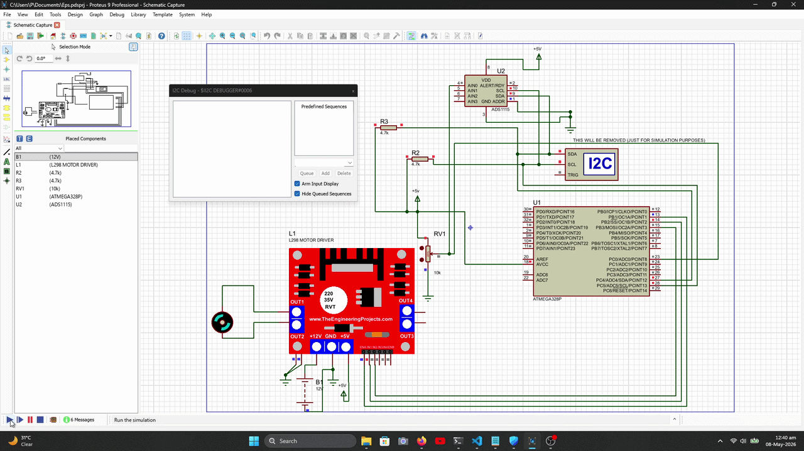

# Autonomous Go-Kart: EPS Motor Spoofing & Control

## System Objective
This repository contains the embedded logic, circuit design, and virtual simulations for controlling a Suzuki Alto Electric Power Steering (EPS) motor. To integrate the EPS into an autonomous go-kart platform, custom PID control loops were engineered to "spoof" the native torque sensor signals, allowing a microcontroller to dictate steering angles autonomously.

## Hardware Architecture
The custom control board relies on the following core components:
* **Microcontroller (ATmega328P):** Handles the core PID control loops, serial communication, and PWM generation.
* **ADS1115 (16-bit ADC):** Utilized over the standard internal ADC to provide the ultra-precise voltage resolution required to accurately spoof and read the delicate torque differential signals typical in OEM steering columns.
* **L298 Motor Driver:** Acts as the power stage/H-bridge to drive the simulated load and interface with the larger EPS motor controller.

---

## Phase 1: Virtual Circuit Validation (Proteus)
Prior to physical hardware deployment, the entire system architecture—including the microcontroller firmware, ADC communication (I2C), and PWM signal generation—was modeled and validated using **Proteus VSM**. 

Simulating the circuit prevented potential hardware damage to the expensive EPS motor controller and allowed for the safe tuning of the initial PID parameters.

### Simulation Demonstration
*(The simulation below demonstrates the microcontroller successfully reading the simulated torque input via the ADS1115 and generating the corresponding PWM drive signals to the L298 motor driver).*



### Schematic Design
The complete wiring schematic used for both the virtual simulation and the physical PCB layout.
*(Click to expand or view the full PDF in the `proteus_simulation` folder).*

> **Note on Simulation:** Certain components, such as visual logic analyzers and manual potentiometers (RVT/RV1), were included strictly for runtime debugging in the simulation environment and are replaced by the autonomous logic unit in the final hardware.

---

## Phase 2: Embedded Firmware (C / C++)
The hardware code (`main.c` / `.ino`) is responsible for the real-time execution of the steering logic. 

**Core Firmware Tasks:**
1. **I2C Polling:** Continuously polls the ADS1115 for high-resolution target angle requests.
2. **Signal Spoofing:** Translates the digital target into the specific dual-analog voltage ranges expected by the Suzuki Alto EPS ECU.
3. **PID Execution:** Calculates the error between the current steering angle and the target angle, applying Proportional, Integral, and Derivative corrections to output a smooth PWM signal to the motor driver.

---

## Repository Structure

```text
EPS-Motor-Spoofing/
│
├── hardware_code/
│   └── main.c                    # Firmware containing I2C, PID, and PWM logic
│
├── proteus_simulation/
│   ├── Eps.pdsprj      # The raw Proteus simulation project file
│   └── Eps.pdf                   # High-resolution circuit schematic
│
├── simulation.gif    # Video capture of the active simulation
└── README.md                     # System documentation
